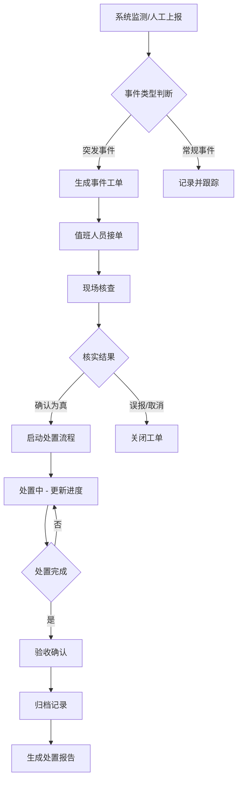
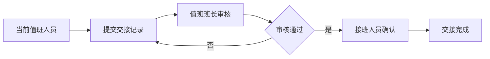

# 数字孪生城市运行驾驶舱 - 产品需求文档

## 1. 产品概述

数字孪生城市运行驾驶舱是一个面向城运中心值班人员的综合性可视化监控平台,通过实时数据采集、三维地图展示和智能分析,实现对城区运行状态的全面感知和精准管控。系统整合交通、管网、环境等多源数据,为城市管理提供科学决策支撑,提升城市运行效率和应急响应能力。

目标用户为城运中心值班人员,需要7×24小时监控城区运行状态,快速发现并处置各类突发事件。系统提供直观的数据可视化和便捷的操作界面,降低值班人员的工作负担,提高城市治理现代化水平。

## 2. 核心功能

### 2.1 用户角色

| 角色 | 注册方式 | 核心权限 |
|------|---------|---------|
| 值班人员 | 管理员分配账号 | 查看全部监控数据、事件处置、值班交接 |
| 值班班长 | 管理员分配账号 | 全部值班人员权限 + 数据导出、报表审核 |
| 系统管理员 | 管理员分配账号 | 全部权限 + 用户管理、系统配置 |

### 2.2 功能模块

1. **总览页面**: 首页仪表盘,展示全局运行态势、核心指标统计、告警信息汇总、轮播大屏入口
2. **地图页面**: 三维地图浏览,支持图层开关、重点区域收藏、实时监控点位、视频联动
3. **交通页面**: 路况热力图、公交到站信息、交通事件监控、重点路段状态
4. **管网页面**: 排水管网监测、积水点实时监控、井盖异常报警、管网巡检记录
5. **环境页面**: 空气质量指数、噪声监测、气象数据、环境指标历史趋势
6. **事件页面**: 事件列表、事件详情弹窗、处置进度跟踪、处置记录管理
7. **报表页面**: 统计数据、日报导出、历史回放、方案预案调用

### 2.3 页面详细功能

#### 总览页面
| 模块名称 | 功能描述 |
|---------|---------|
| 全局态势图 | 展示城区整体运行状态,包括正常、异常、告警区域分布 |
| 核心指标看板 | 实时显示交通流量、管网压力、环境指数等关键指标 |
| 告警信息栏 | 滚动显示最新告警信息,支持点击跳转详情 |
| 快捷入口区 | 提供各子模块的快速访问入口 |
| 轮播大屏入口 | 点击进入全屏大屏展示模式,自动轮播各页面 |

#### 地图页面
| 模块名称 | 功能描述 |
|---------|---------|
| 三维地图 | 基于WebGL的三维城市模型,支持缩放、旋转、倾斜等交互 |
| 图层控制 | 开关显示交通图层、管网图层、环境监测点、视频监控点等 |
| 区域收藏 | 用户可收藏重点关注区域,快速定位和一键跳转 |
| 实时监控 | 在地图上显示各类监控点位的实时状态 |
| 视频联动 | 点击监控点位可弹窗播放实时视频流 |
| 截图标注 | 支持在地图上截图并进行标注,保存为记录 |

#### 交通页面
| 模块名称 | 功能描述 |
|---------|---------|
| 路况热力图 | 实时展示道路拥堵程度,红黄绿三色标识 |
| 公交到站 | 显示公交线路和到站时间,支持搜索线路 |
| 交通事件 | 展示交通事故、道路施工等事件信息 |
| 重点路段 | 高亮显示重点关注路段的实时状态 |

#### 管网页面
| 模块名称 | 功能描述 |
|---------|---------|
| 管网拓扑图 | 展示排水管网走向 and 节点分布 |
| 积水点监测 | 实时监测易积水点的水位高度,超标告警 |
| 井盖异常 | 监测井盖倾斜、移位、缺失等异常状态 |
| 巡检记录 | 展示管网巡检的历史记录和巡检计划 |

#### 环境页面
| 模块名称 | 功能描述 |
|---------|---------|
| 空气指数 | 显示AQI、PM2.5、PM10等空气质量指标 |
| 噪声监测 | 展示各监测点的噪声分贝值 |
| 气象数据 | 温度、湿度、风速、风向等气象信息 |
| 历史趋势 | 折线图展示各项指标的历史变化趋势 |

#### 事件页面
| 模块名称 | 功能描述 |
|---------|---------|
| 事件列表 | 按时间、街道、类型筛选展示事件 |
| 事件详情 | 弹窗显示事件完整信息,包括位置、时间、描述、图片 |
| 处置进度 | 跟踪事件处置流程,显示当前状态和责任人 |
| 处置记录 | 记录事件处置过程,支持添加备注和附件 |

#### 报表页面
| 模块名称 | 功能描述 |
|---------|---------|
| 统计概览 | 展示各项运行数据的统计分析 |
| 日报导出 | 按日期生成日报,支持导出为PDF/Excel |
| 历史回放 | 回放历史时间段的监控数据 |
| 方案预案 | 展示应急预案和处置方案,支持调用 |

### 2.4 通用功能

| 功能 | 描述 |
|-----|------|
| 筛选功能 | 支持按街道、时间范围、事件类型进行数据筛选 |
| 搜索功能 | 快速搜索监控点位、事件、预案等 |
| 值班交接 | 值班人员可提交交接班记录,确保工作连续性 |
| 大屏轮播 | 全屏模式下自动轮播各页面,适合指挥中心大屏展示 |
| 截图标注 | 支持截取当前页面或地图进行标注和保存 |

## 3. 核心流程

### 3.1 事件发现与处置流程

### 3.2 值班交接流程

## 4. 用户界面设计

### 4.1 设计风格

- **整体定位**: 科技感强、专业权威的指挥控制台风格
- **色彩方案**: 深色主题为主,突出数据和告警信息
  - 主色:深蓝色 #0a1628 作为背景
  - 辅色:科技蓝 #00d4ff 用于强调和交互
  - 告警色:红色 #ff4757 用于异常和告警
  - 正常色:绿色 #2ed573 用于正常状态
  - 警示色:橙色 #ffa502 用于注意和待处理
- **按钮风格**: 圆角按钮,带发光效果,hover时有光晕动画
- **字体选择**: 
  - 标题:思源黑体 Bold / Source Han Sans CN Bold
  - 数据:Roboto Mono / 等宽字体用于数字显示
  - 正文:思源黑体 Regular
- **布局风格**: 左右分栏布局,左侧为导航菜单,右侧为内容区
- **图标风格**: 线性图标,科技感强,统一描边宽度

### 4.2 页面设计概览

| 页面 | 布局结构 | 核心视觉元素 |
|-----|---------|------------|
| 总览 | 顶部标题栏 + 4宫格指标卡 + 中央态势图 + 底部告警滚动条 | 动态数字,脉冲动画,渐变发光 |
| 地图 | 全屏地图 + 右侧浮动控制面板 + 左下角图例 | 3D建筑模型,热力叠加,标注气泡 |
| 交通 | 地图+列表混合视图 + 实时公交到站面板 | 道路颜色渐变,公交图标动画 |
| 管网 | 管网拓扑图 + 监测数据面板 | 管道流向动画,节点闪烁告警 |
| 环境 | 数据仪表盘 + 趋势图表 + 监测点地图 | 环形进度图,折线动画 |
| 事件 | 筛选栏 + 事件列表 + 详情弹窗 | 状态标签,时间轴,进度条 |
| 报表 | 统计卡片 + 图表区 + 导出工具栏 | 数据可视化图表,打印图标 |

### 4.3 响应式设计

- **桌面优先**: 专为1920x1080及以上分辨率优化
- **大屏适配**: 支持4K分辨率,元素按比例放大
- **交互优化**: 支持键盘快捷键、鼠标滚轮、双击等操作
- **辅助功能**: 支持高对比度模式,保证告警信息清晰可见

## 5. 技术约束

### 5.1 浏览器兼容性

- Chrome 90+
- Firefox 88+
- Edge 90+
- Safari 14+

### 5.2 性能要求

- 页面首屏加载时间 < 3秒
- 地图渲染帧率 ≥ 30fps
- 实时数据刷新间隔 5-10秒
- 支持同时在线用户 ≥ 100人

### 5.3 数据更新策略

- 实时监控数据: WebSocket推送,5秒刷新
- 静态配置数据: 定时轮询,30秒刷新
- 用户操作反馈: 即时响应
