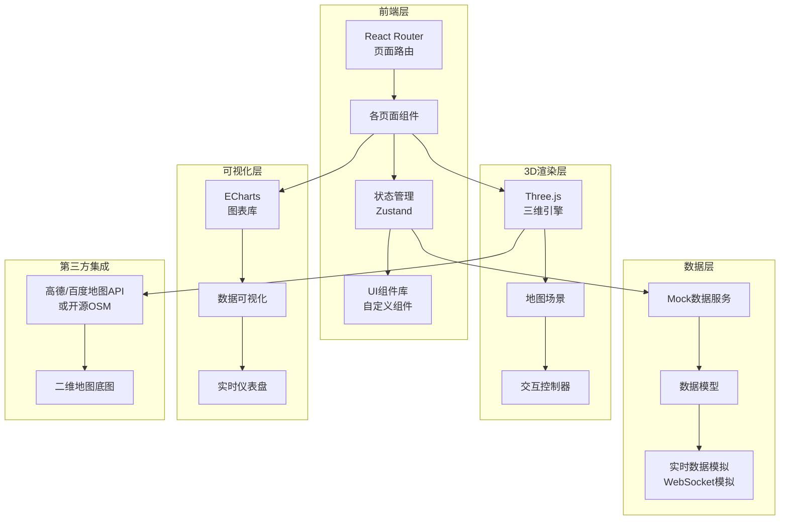
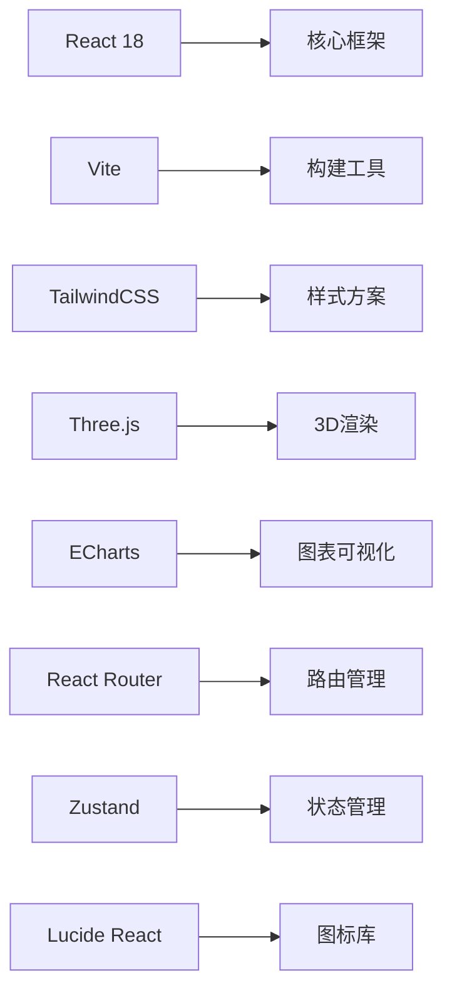
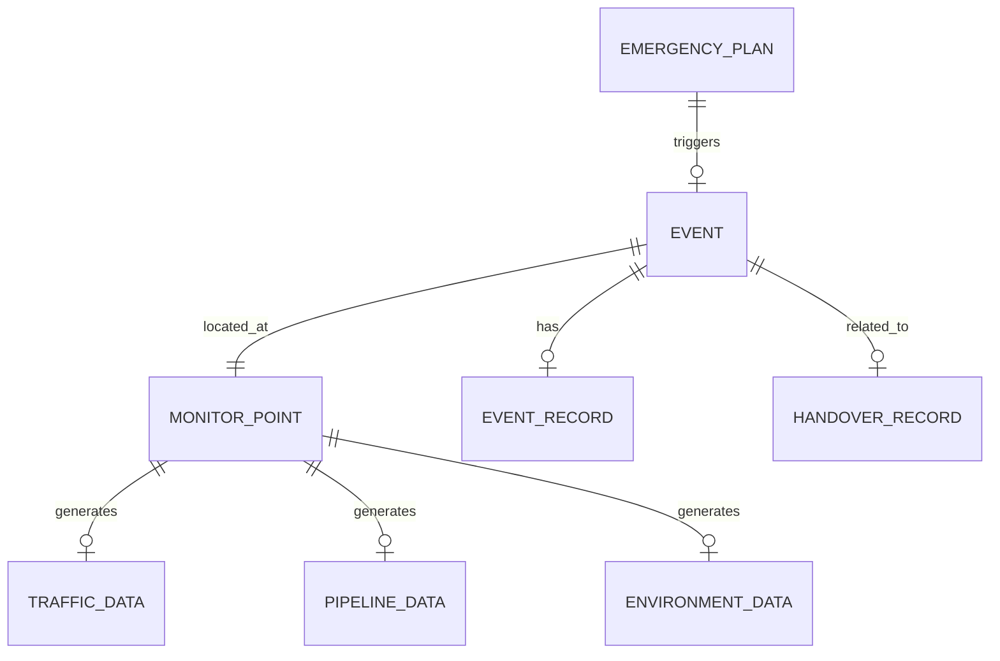

# 数字孪生城市运行驾驶舱 - 技术架构文档

## 1. 架构设计

### 1.1 系统架构图



### 1.2 技术栈概览



## 2. 技术选型说明

### 2.1 前端框架

- **React 18**: 成熟的组件化框架,适合构建复杂的管理系统
- **TypeScript**: 提供类型安全,减少运行时错误
- **Vite**: 快速的开发服务器和构建工具

### 2.2 样式方案

- **TailwindCSS**: 原子化CSS框架,提高开发效率
- **自定义CSS变量**: 用于主题色彩管理和动态样式
- **PostCSS**: 处理CSS兼容性和自定义语法

### 2.3 3D地图技术

- **Three.js**: 强大的WebGL 3D渲染库
- **@react-three/fiber**: React的Three.js绑定库
- **@react-three/drei**: Three.js常用工具集合
- **OSMBuildings**: 开源三维建筑数据

### 2.4 数据可视化

- **ECharts**: 百度开源图表库,支持丰富的图表类型
- **echarts-for-react**: React封装组件

### 2.5 状态管理与路由

- **React Router v6**: SPA路由管理
- **Zustand**: 轻量级状态管理库
- **React Hook Form**: 表单处理

### 2.6 UI组件

- **Lucide React**: 线性图标库
- **自定义组件**: 根据设计规范构建的专用组件

## 3. 路由定义

| 路由路径 | 页面名称 | 功能描述 |
|---------|---------|---------|
| / | 总览首页 | 全局态势、核心指标、告警汇总 |
| /map | 地图页面 | 三维地图、图层控制、监控联动 |
| /traffic | 交通页面 | 路况热力、公交到站、交通事件 |
| /pipeline | 管网页面 | 管网监测、积水点、井盖监控 |
| /environment | 环境页面 | 空气指数、噪声、气象数据 |
| /events | 事件页面 | 事件列表、处置跟踪、记录管理 |
| /report | 报表页面 | 统计概览、日报导出、历史回放 |
| /login | 登录页面 | 用户身份认证 |
| /handover | 值班交接 | 交接班记录提交与审核 |

## 4. 数据模型定义

### 4.1 核心数据模型

```typescript
// 监控点位数据
interface MonitorPoint {
  id: string;
  name: string;
  type: 'traffic' | 'pipeline' | 'environment' | 'video';
  position: { lat: number; lng: number; altitude?: number };
  status: 'normal' | 'warning' | 'error' | 'offline';
  data: Record<string, any>;
  lastUpdate: string;
}

// 交通数据
interface TrafficData {
  roadId: string;
  roadName: string;
  congestionLevel: 'smooth' | 'slow' | 'congested';
  vehicleCount: number;
  averageSpeed: number;
  updateTime: string;
}

// 公交到站数据
interface BusArrival {
  lineId: string;
  lineName: string;
  stationName: string;
  arrivals: Array<{
    busId: string;
    arrivalTime: string;
    distance: number;
  }>;
}

// 管网监测数据
interface PipelineData {
  nodeId: string;
  nodeName: string;
  waterLevel: number;
  pipePressure: number;
  hasAnomaly: boolean;
  anomalyType?: 'water_ponding' | 'manhole_cover' | 'pipe_leak';
}

// 环境监测数据
interface EnvironmentData {
  stationId: string;
  stationName: string;
  aqi: number;
  pm25: number;
  pm10: number;
  noise: number;
  temperature: number;
  humidity: number;
  windSpeed: number;
  windDirection: string;
}

// 事件数据
interface Event {
  id: string;
  title: string;
  type: 'traffic' | 'pipeline' | 'environment' | 'safety' | 'other';
  level: 'low' | 'medium' | 'high' | 'critical';
  street: string;
  position: { lat: number; lng: number };
  description: string;
  status: 'pending' | 'processing' | 'resolved' | 'closed';
  reporter: string;
  createTime: string;
  updateTime: string;
  handler?: string;
  progress: number;
  records: EventRecord[];
}

// 事件处置记录
interface EventRecord {
  id: string;
  eventId: string;
  operator: string;
  action: string;
  remark?: string;
  attachments?: string[];
  createTime: string;
}

// 值班交接记录
interface HandoverRecord {
  id: string;
  shiftType: 'day' | 'night';
  handOverBy: string;
  handOverTo: string;
  summary: string;
  pendingEvents: string[];
  remarks: string;
  status: 'pending' | 'approved' | 'rejected';
  createTime: string;
  approveTime?: string;
}

// 预案数据
interface EmergencyPlan {
  id: string;
  name: string;
  type: string;
  level: string;
  content: string;
  triggerConditions: string[];
  procedures: string[];
  contacts: string[];
  updateTime: string;
}
```

### 4.2 数据关系图



## 5. Mock数据策略

### 5.1 数据生成方案

- **静态Mock**: 预设的监控点位列表、街道信息、事件类型等基础数据
- **动态模拟**: 使用setInterval模拟实时数据更新
- **随机波动**: 对数值型数据添加合理范围的随机波动,模拟真实场景
- **事件模拟**: 定时生成模拟事件,测试事件处理流程

### 5.2 数据更新机制

```typescript
// 模拟实时数据更新
const useRealTimeData = () => {
  const [data, setData] = useState(initialData);
  
  useEffect(() => {
    const interval = setInterval(() => {
      setData(prev => ({
        ...prev,
        metrics: updateMetrics(prev.metrics),
        alerts: generateAlerts(),
        lastUpdate: new Date().toISOString()
      }));
    }, 5000); // 5秒刷新
    
    return () => clearInterval(interval);
  }, []);
  
  return data;
};
```

## 6. 目录结构

```
src/
├── components/           # 可复用组件
│   ├── common/          # 通用组件 (Button, Card, Modal等)
│   ├── layout/          # 布局组件 (Sidebar, Header, Container)
│   ├── charts/          # 图表组件
│   ├── map/             # 地图相关组件
│   └── event/           # 事件相关组件
├── pages/               # 页面组件
│   ├── Overview/       # 总览页面
│   ├── Map/             # 地图页面
│   ├── Traffic/         # 交通页面
│   ├── Pipeline/        # 管网页面
│   ├── Environment/     # 环境页面
│   ├── Events/          # 事件页面
│   ├── Report/          # 报表页面
│   ├── Login/           # 登录页面
│   └── Handover/        # 值班交接页面
├── stores/              # 状态管理
│   ├── useAppStore.ts   # 全局状态
│   ├── useMapStore.ts   # 地图状态
│   ├── useEventStore.ts # 事件状态
│   └── useUserStore.ts  # 用户状态
├── services/           # 数据服务
│   ├── mockData.ts      # Mock数据生成
│   └── api.ts           # API接口 (预留)
├── hooks/               # 自定义Hooks
├── utils/               # 工具函数
├── types/               # TypeScript类型定义
├── styles/              # 全局样式
│   └── variables.css    # CSS变量定义
├── App.tsx              # 根组件
└── main.tsx             # 入口文件
```

## 7. 性能优化策略

### 7.1 3D地图优化

- **LOD (Level of Detail)**: 根据相机距离动态调整模型精度
- **实例化渲染**: 批量渲染相同几何体
- **视锥剔除**: 只渲染相机可见区域的对象
- **纹理压缩**: 使用压缩纹理减少显存占用
- **渐进加载**: 优先加载近处高精度模型,远处低精度

### 7.2 React性能优化

- **React.memo**: 对不需要频繁更新的组件进行memo化
- **useMemo/useCallback**: 缓存计算结果和回调函数
- **虚拟列表**: 对长列表进行虚拟滚动
- **代码分割**: 使用React.lazy实现路由级代码分割
- **图片优化**: 使用WebP格式,懒加载图片

### 7.3 数据加载策略

- **骨架屏**: 加载过程显示骨架屏,提升感知性能
- **预加载**: 预测用户行为,提前加载可能需要的资源
- **缓存**: 合理使用浏览器缓存和内存缓存

## 8. 部署架构

### 8.1 构建配置

- **环境变量**: 根据环境(development/production)加载不同配置
- **代码分割**: 使用Vite的build选项进行优化
- **CDN部署**: 静态资源部署到CDN,提升加载速度

### 8.2 开发服务器

- **Vite Dev Server**: 快速的开发服务器和热更新
- **代理配置**: 开发环境代理API请求到后端服务

## 9. 第三方库依赖

| 库名称 | 版本 | 用途 |
|-------|------|------|
| react | ^18.2.0 | 核心框架 |
| react-dom | ^18.2.0 | DOM渲染 |
| react-router-dom | ^6.20.0 | 路由管理 |
| three | ^0.160.0 | 3D渲染 |
| @react-three/fiber | ^8.15.0 | React-Three绑定 |
| @react-three/drei | ^9.92.0 | Three.js工具集 |
| echarts | ^5.4.3 | 图表可视化 |
| echarts-for-react | ^3.0.2 | React-ECharts封装 |
| zustand | ^4.4.7 | 状态管理 |
| lucide-react | ^0.294.0 | 图标库 |
| tailwindcss | ^3.3.6 | 样式框架 |
| vite | ^5.0.8 | 构建工具 |
| typescript | ^5.3.3 | 类型系统 |
